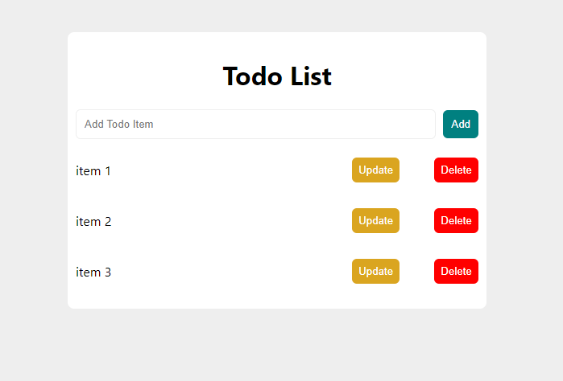

# MERN Stack ToDo App

MERN Stack Application with the list of task you need to complete or things you want ToDo can be managed via this application.

you can add, update or remove todo.

below are the screenshots of the app



to run the application follow below process.

## Backend

copy ".env.example" file and rename it as ".env" and add mongodb connection url

goto "server" directory and run below commands

```sh
npm install
npm run start
```

## Frontend

goto "client" directory and run below commands

```sh
npm install
npm run start
```
